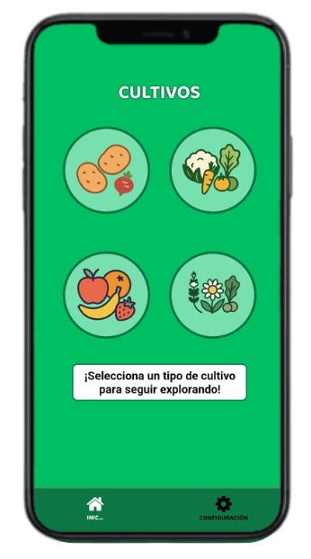
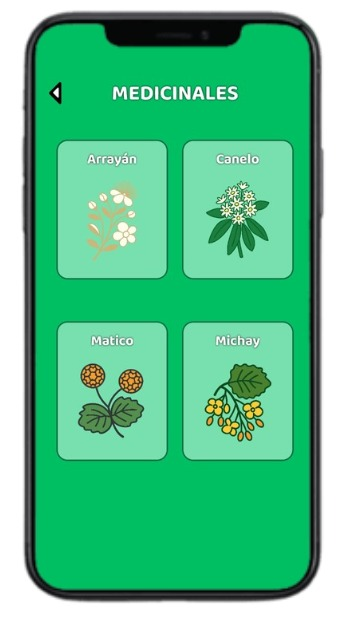
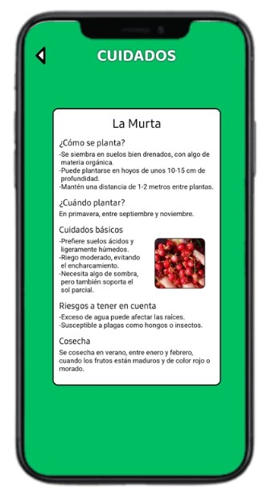

# App Móvil Siembra y Cultivo (EcoChiloé) 

   

Esta es una **aplicacion movil** inspirada en la siembra y cultivo mediante esta, **basado en Chiloé** con el fin de llegar a un grupo de personas mas enfatizada en niños que esten cursando basica para generar entretenimiento mediante el conocimiento sobre este tema.

**DESARROLLO EN:**

## Descripción de la Aplicacion:

La creación de esta aplicación es importante, ya que entregará información clara y accesible sobre distintos tipos de cultivos, sus cuidados, temporadas ideales de siembra, tiempos de cosecha y herramientas necesarias. Motivando a las personas de cualquier edad, en concreto a los niños, para que puedan crear sus propios huertos, lo que aportará a la conciencia sostenible al mostrar la importancia de todos los procesos que lleva el cultivar.

Como alcance queremos:
- **Aprender cuándo y cómo sembrar**
- **Conocer cuidados y riesgos de los cultivos**
- **Ver información sobre diferentes variedades locales**
La app no contara con:
- **Venta de productos**
- **Compra de insumos agrícolas**
- **Anuncios en la aplicación**
  
El objetivo del análisis es identificar los contaminantes más importantes en diferentes ciudades, y preparar los datos para análisis futuros mediante procesos de limpieza, transformación, y visualización.

## Estructura del Repositorio

La estructura del proyecto es la siguiente:

###  **Objetivos**

**General**

Desarrollar una aplicación móvil educativa e interactiva que funcione como guía práctica
de siembra y cultivo enfocada para niños y niñas de aducación básica y personas que desean aprender sobre la agricultura de la isla de Chiloé, con el fin de fomentar el aprendizaje
agrícola, la auto-sustentabilidad y el vínculo con el medio ambiente.

## 📲 Características principales

- ✅ **Facilidad de uso** Atractivo e interactivo para su uso.
- 🔍 **Busqueda amplia** Organizado por conjuntos o por el nombre propio.
- 📋 **Progreso de cultivos** con seguimiento de etapas de crecimiento.
- 📚 **Guías interactivas** para cultivo de hortalizas, frutas y cereales.
- 🧑‍🌾 Comunidad de usuarios con foro de preguntas y consejos.
